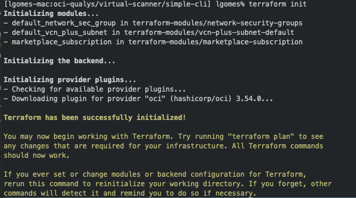
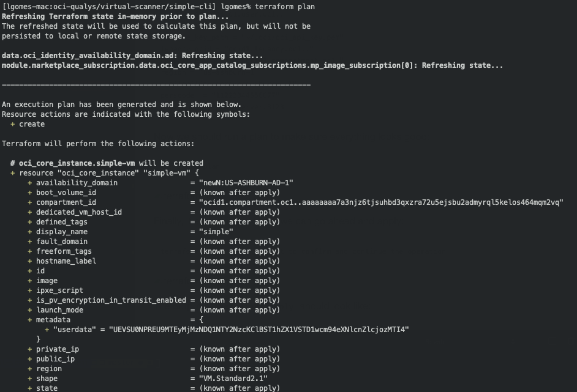
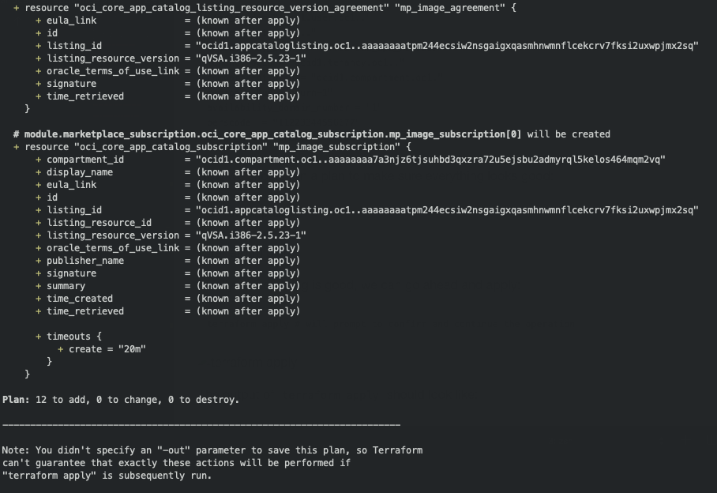
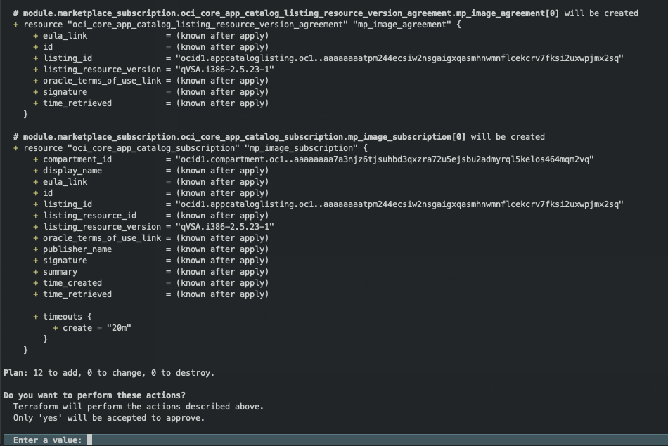
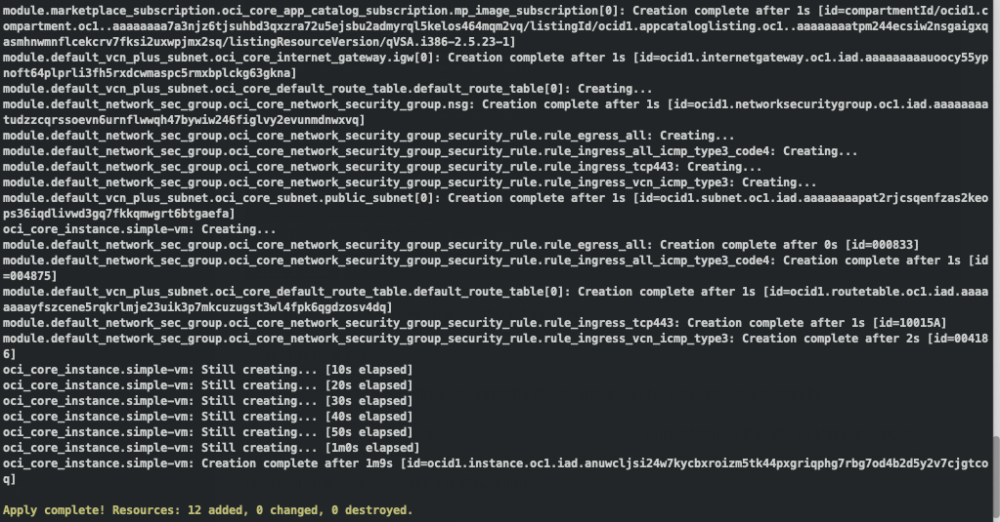

# Qualys Virtual Scanner appliance

These are Terraform modules that deploys [Qualys Virtual Scanner appliance](https://cloudmarketplace.oracle.com/marketplace/app/qualys-oci_scanner) on [Oracle Cloud Infrastructure (OCI)](https://cloud.oracle.com/en_US/cloud-infrastructure) from the Oracle Cloud Infrastructure Marketplace.

## Prerequisites

- Customers will have an active Qualys subscription.
- Scanner personalization code (14 digits) obtained from your Qualys account.

## Overview

Qualys Virtual Scanner [simple](./simple/) template should provision all necessary [Networking](https://docs.cloud.oracle.com/iaas/Content/Network/Concepts/overview.htm#OverviewofNetworking) Infrastructure resources to enable you to launch a Virtual Scanner VM, including [VCN](https://docs.cloud.oracle.com/iaas/Content/Network/Concepts/overview.htm#components), Public Subnet, Internet Gateway, Route Tables, Network Security Groups.

## Getting Started - Clone the module

Now, we'll want a local copy of this repo by running:

```git
git clone https://github.com/oracle-quickstart/oci-qualys.git
```

## Deploy Simple from Terraform CLI

The TF templates can be initialized by running the following commands:

```bash
cd oci-qualys/virtual-scanner/simple
terraform init
```

This gives the following output:



Next, you should modify our template variables accordingly to our OCI Tenancy.
You can use the boilerplate available on [terraform.tfvars.template](./simple/terraform.tfvars.template) to setup the OCI provider variables. Rename the file to `terraform.tfvars` so that Terraform CLI can automatically pick it up as the default variables configuration overriding the content of [variables.tf](./simple/variables.tf).

```bash
user_ocid = "ocid1.user.oc1.."
fingerprint = "1c.."
private_key_path = "~/.oci/oci_api_key.pem"
tenancy_ocid = "ocid1.tenancy.oc1.."
compartment_ocid = "ocid1.compartment.oc1."
region = "us-ashburn-1"
availability_domain_number = "1"
perscode  = "11223344556677"
proxy_url = "proxyserver:3128"
```

Now we should run a plan to make sure everything looks good:

```terraform
terraform plan
```




Finally, if everything is good, we can go ahead and apply:

```terraform
terraform apply # will prompt to confirm and continue the operation
```



The output of `terraform apply` should look like:



If all the settings are configured correctly the scanner will be activated successfully.

You can optionally create a [Instance Console connection](https://docs.cloud.oracle.com/iaas/Content/Compute/References/serialconsole.htm) and attach to the VM to track the boot and activation progress. Then you can connect to the Serial console using a Secure Shell (SSH) or VNC console using a VNC client.

Additional details available on [Qualys Virtual Scanner documentation](https://discussions.qualys.com/docs/DOC-6657-qualys-virtual-scanner-appliance-in-oracle-cloud-infrastructure).
